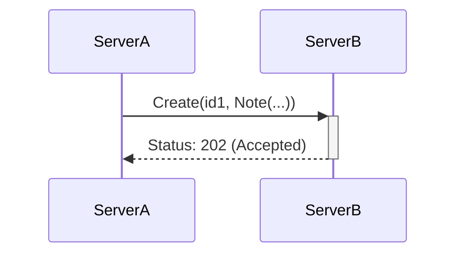
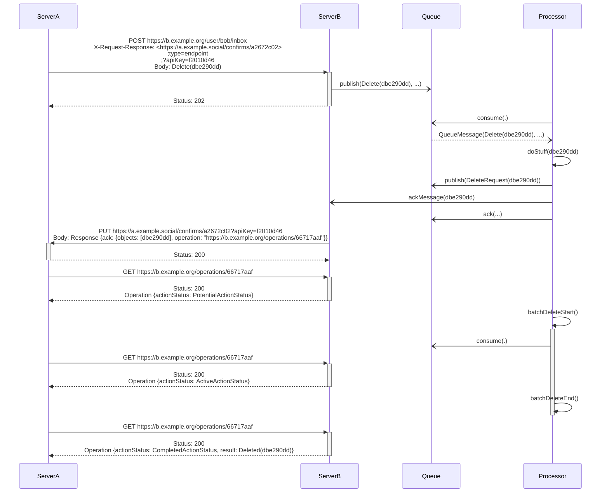
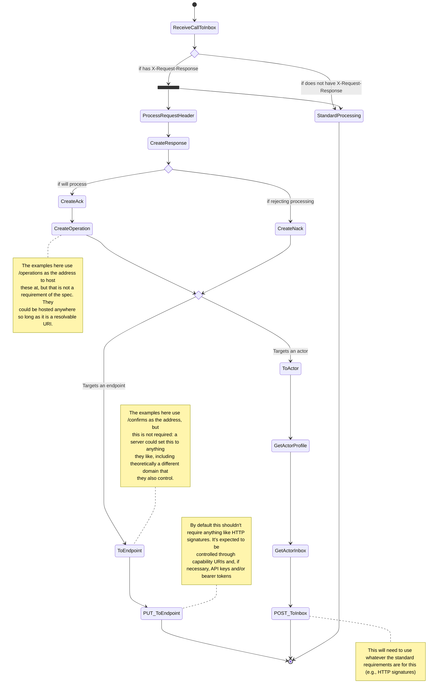

# FEP-6f55: Control Messages for Social Networks

## Introduction

There is frequently a requirement in the fediverse applications to send “out of band” information, or to dictate to an endpoint that certain message classes require specialized handling.

Examples are:

1. Acknowledgements
2. Long-running operations
3. When a request is being proxied, such that a party other than the creator of the object has an interest in some aspect of the processing or followups

These messages are things like debug messages and control messages--things that are only applicable directly between the servers communicating and not something that should be widely or more broadly acted upon.

This design seeks to provide a flexible way to notify servers of these in a way that works well on HTTP systems. It is predominantly focused on ActivityPub, but could be adapted to other protocols.

There are no extant implementations as of this writing. It is currently being added to Njall (a FeatherPub implementation), which has not been released yet.

## Motivation

In specifically the cases of deletion, flagging, and testing there needs to be a way to receive confirmation when the message has been processed and when it has been actioned, possibly with some metadata about how it was actioned.

This is a different use case in many ways from "I want to know about the actions of _anyone who has acted upon this object_. Rather, the desire is to have a way to say "give me information about **your** actions on _this_ object."

For example in the following scenario:



In a standard distributed systems context it would be common for `ServerB` to write out the message to a queue, with no guarantees:

1. When it will process the object in question.
2. What it will do when it processes it. Will it just deliver it, will it host it locally?
3. If it fails, what is the expected result?

The fundamental problem is that when two systems are communicating asynchronously, it is challenge (to impossible, depending on details) to know whether the other server hasn't replied because it is:

1. Slow
2. Never saw the message it is supposed to be replying to
3. Does not support the header in question or otherwise know that it is supposed to respond.

Control messages are a way of alleviating this by allowing a tester to send a _specialized header_ in the HTTP request, telling `ServerB` "please notify me that you have gotten this message and also give me a way to stay updated about whatever happens." This model also follows the common pattern of separating the _acknowledgement of receipt_ from the _start of any action_.

This design is for a _minimalistic interpretation_ of this. It places no requirements around what is actually returned, simply providing a way for that to be declared and to allow for very basic interoperability around this. It is the goal that further designs and extensions cover the specific content of how this is executed.

To do this, it follows standard patterns found in queue processing:

- STOMP's [Ack and Nack](https://stomp.github.io/stomp-specification-1.2.html#ACK)
- RabbitMQ/AMQP 0.9.1's [Customer Acknowledgements and Publisher Confirms](https://www.rabbitmq.com/confirms.html)

It also shows up as a common feature in actor models handling flow controls, for example [Akka's write modes](https://doc.akka.io/docs/akka/current/io.html#write-models-ack-nack-). It also has some resemblance (if treated in-line) to a standard pattern for handling [long-running operations](https://google.aip.dev/151).

## Goals

- Provide a mechanism for two servers to **acknowledge receipt** of a message.
- Provide information about how they have acted upon a given object in ActivityPub.
- Provide a mechanism for a server to **request** information about a given message.
- Require only a JSON parser in order to use it effectively.
- Easily integrate with standard HTTP servers.

### Non-Goals

- This does not aim to integrate with ActivityPub directly. There is an ActivityPub _projection_ of the base protocol, but it is a projection.
- This is not a generic webnotification system. It is not designed to know when _anyone_ has acted on an object, or in what way. It does not seek to solve the general problems in this.
- This is **not** a push-notification system. There is one (1) pushed acknowledgement, and then after that it is considered part of the callers responsibility to follow up.

## High Level Discussion and Design: Ack and Nack

The current flow for a Delete in server-to-server communication is:

- `Server A` deletes the message locally.
- `Server A` sends a `Delete` to others who had a copy of the message, including `Server B`.
- `Server B` has [no strong obligation to delete the message](https://www.w3.org/TR/activitypub/#delete-activity-inbox) and can essentially take the deletion as advisory.
- `Server A` has no idea what `Server B` did or did not do and no way to follow up and confirm.

There are several categories of message where this comes up as a significant concern. Specifically:

- `Delete` messages. Where in particular for compliance purposes a server would like to know what actions were taken and, if they don't know, a shorter list of others to forward compliance requests to.
- `Flag` messages. It is often important from a trust and safety perspective to know what actions have been taken.
- `Undo` messages. This is the least important of these three, but when an undo is received it is important to know that at least _something_ has been done.

To do this the design introduces three objects.

Two top-level objects:

- `Ack`, a statement by the service that it has _received the message in question_, that it _understands the message's request_, and that it will _attempt to take some action_ based on it, with a receipt indicating what the outcome is. It does not guarantee that the action will succeed, but it does guarantee that something will be attempted and that the (provided) receipt will be updated.
- `Nack`, a statement by the service that it is _rejecting the message entirely_ and that _no further action will be taken on the request_.

`Ack` and `Nack` by design can apply to multiple messages at the same time. `Ack` works as a werapper for the `Operation` object, while `Nack` says that an `Operation` object will **not** be generated.

One receipt object:

- `Operation`, an object that contains updates for how the object(s) in question have been handled. It is expected that the server will keep this object up to date with what has changed.

An example flow for a `Delete` might look like this.



Here `ServerB` is engaging a batch delete that runs once a week. This has numerous advantages from a performance standpoint, especially on tables with high traffic in a database with PSQL.

The process therefore goes:

1. Alice deletes a message on `ServerA`
2. `ServerA` deletes the message and, as part of that, forwards a `Delete` to `ServerB` with a specialized header.
3. `ServerB` responds by `Accept`ing the message and putting it onto a queue.
4. Later `ServerB`'s processor runs and consumes the message from the queue.
5. `ServerB` decides the message is copacetic and writes the delete request back to the queue onto an exchange for the batch delete process.
6. `ServerB` sends an `Ack` with a link to the `Operation` object to `ServerA`, using a `PUT` to a designated URI.
7. When `ServerA` asks after that `Operation` they are told that it is in a [Potential](https://schema.org/PotentialActionStatus) state.
8. Later `ServerB` starts the process of doing the batch delete. If `ServerA` asks it will now see that the operation is in an [Active](https://schema.org/ActiveActionStatus).
9. `ServerB` finishes and the `Operation` now will be seen by `ServerA` as being in a [Completed](https://schema.org/CompletedActionStatus) state with an attached result.

While the focus here is on `Ack`, `Nack`, and `Operation` this design seeks to provide a flexible framework for other types of responses in the future without making it overly complicated for an implementer today.

### Semantics

This is different semantically than `Accept`/`Reject` in several different ways. `Ack` is an _acknowledgement_ but does not say anything about **how** the server will (eventually) respond, while providing a way to track it.

By example, consider what would happen if someone requested a response on a `Follow` request. In ActivityPub a `Follow` request that has received an `Accept` has succeeded and is now added to the `follows` and `followers` collections. `TentativeAccept` is still a subclass of type `Accept` and so can be read as an "acceptance that we will later reject" rather than as something semantically unique from this flow.

Instead, the `Ack` communicates to the originating server "I have got this message and will process it, here's an operation you can look up to see where I am with the process." Then it updates the operation _to indicate completion_. It does not make any guarantees of what that completion looks like (a `Reject` is a successful completion), nor does it need to return what the specific outcome was (though it could).

Because this message is not sent back to the originating inbox but to the _server_ it means that a server can examine a separate endpoint--and not all incoming traffic--to know when the request was completed. Further, because this message does not require any form of HTTP signature, it makes it so that a different server entirely, with tighter permissions, could track the receipt or test the outcome.

Conversely, a `Nack` would imply that the server is dropping the message on the floor. It isn't a `Reject`, it is a statement that the server has not processed the message **and will not do so**. This allows an overloaded server to apply backpressure, or allows it a mechanism to say "this server does not support that message class" without creating a separate object for each such message.

## Detailed Design

Overall the control flows are designed to allow objects to communicate information about what they are doing with respect to other objects. They are a way for a **server** to inform another **server** (not an actor informing an actor) how they are handling the message and engage in content negotiation.

To do this the design follows a standard pattern found in message queues and asynchronous systems: sending a token back to the caller so that they can track the progress of their message.

For the purpose of this design the focus is on three message types and the flows around them:

- Ack
- Nack
- Operation

The design should be flexible enough to apply to other (non-Ack) use cases, but these are the focus of this document.

Also included are details on how to request a message and how to reply, along with information about how to handle the results and outcomes from these calls.

### HTTP Header

The design adds a single custom HTTP request header:

- `X-Request-Response` this indicates that the message is _requesting a response_.

It follows a syntax similar to the `Link` header: "&lt;uri&gt;;property=value;property=value...". Multiple request responses are supported, though aren't expected to come up frequently at present.

It supports the following parameters. Values vary but MUST be escaped.

- `requested` -- indicates the kind of response being requested. If not specified defaults to "acknowledgement," which is the only value defined in this document.
- `?<param>` -- indicates the pesence of a _query parameter_ to use when making the call back. Useful for things like api keys and capability tokens (see Security section for more). Only supported for the `endpoint` type.
- `type` -- an enum of `endpoint` and `actor`. Defaults to `endpoint`.

### Object Model

The object model is divided into two _projections_. These are designed to play nicely with just strict JSON parsers and also play nicely inside of ActivityPub based systems regardless of specifics of how the underlying implementations work. By providing mechanisms for servers to request one or the other it also allows servers to only support on _read_ one format or the other.

#### JSON Projection

This projection uses the `application/json` media type.

The response object is specified as follows:

```json
{
  "$schema": "https://json-schema.org/draft/2019-09/schema",
  "title": "JSON Projection of the response object",
  "type": "object",
  "properties": {
    "nack": {
      "type": "object",
      "properties": {
        "objects": {
          "type": "array",
          "items": {
            "type": "string"
          }
        },
        "status": {
          "type": "number"
        },
        "cause": {
          "type": "object",
          "properties": {},
          "required": []
        }
      },
      "required": ["objects"]
    },
    "ack": {
      "type": "object",
      "properties": {
        "objects": {
          "type": "array",
          "items": {
            "type": "string",
            "format": "uri"
          }
        },
        "operation": {
          "type": "string",
          "format": "uri"
        }
      },
      "required": ["objects"]
    }
  },
  "oneOf": [{ "required": ["ack"] }, { "required": ["nack"] }]
}
```

This avoids the "self-typing" phenomena found in JSON-LD and adds the ability to distinguish additional response types into the future. It also makes it easy to represent in a binary format.

The `response` Link is a link to the `Operation`. `objects` specifies the receipt addresses of the objects acted upon.

`Operation` would be:

```json
{
  "$schema": "https://json-schema.org/draft/2019-09/schema",
  "title": "JSON projection of the Operation object",
  "type": "object",
  "properties": {
    "actionStatus": {
      "enum": ["PotentialActionStatus", "ActiveActionStatus", "CompletedActionStatus", "FailedActionStatus"]
    },
    "targets": {
      "type": "array",
      "items": {
        "type": "string"
      }
    },
    "result": {
      "type": "object",
      "properties": {},
      "required": []
    },
    "metadata": {
      "type": "object",
      "properties": {},
      "required": []
    },
    "error": {
      "type": "object"
      },
      "required": [
        "error"
      ]
    }
  },
  "required": [
    "actionStatus",
    "targets"
  ]
}
```

The `actionStatus` field mirrors the equivalent field in the `ConsumeAction` [found on schema.org](https://schema.org/ActionStatusType). This is to ensure that the enums are sync'd between the projections. This is an allowance for convenience since it doesn't cost anything to use the same terms and saves a step when dealing with different formats.

The `metadata` field is a free-form object that can vary by the API endpoint, server, and user, but SHOULD NOT vary by response and should be considered functionally immutable.

The `result` object varies by response and is a free form object. This specification places no restrictions around whether this is a mutable object, though it is RECOMMENDED that it be considered immutable once the status is set to complete[^2].

It is RECOMMENDED that the `error` property follow the guidance in [RFC 7807](https://www.rfc-editor.org/rfc/rfc7807).

#### JSON-LD/AS2 Projection

The JSON-LD projection is designed to play nicely with ActivityPub.

Four `type`s are added:

- `Response`, which is a subclass of Activity. `object` is either the URI of the `Operation` or a `Link` pointing to the `Operation`. `context` may be used to indicate the objects being acted upon. Compared to the JSON projection, `object` is the `response` field while `context` is closer semantically to the `objects` field. This can be thought of as a specialization of the [ConsumeAction](https://schema.org/ConsumeAction). It can also be thought of as _Abstract_: nothing should be sent using this type, it exists entirely for semantic cleanliness.
- `Ack` and `Nack`, which are subclasses of `Response` and are disjoint with each other.
- `Operation`, which is a subclass of `Activity` and also borrows from [ConsumeAction](https://schema.org/ConsumeAction). The format of `error` in this situation is changed to be a [Note](https://www.w3.org/TR/activitystreams-vocabulary/#dfn-note) object. This can also be thought of as a specialization of the [ConsumeAction](https://schema.org/ConsumeAction), and as the `result` of the `Response` object.

### Callbacks

Two types of callback are supported, depending on the `type` field in the HTTP header:

- `endpoint` -- call with a PUT object and the `application/json` media type with the JSON projection.
- `actor` -- use a POST and whatever security mechanisms are commonly employed for this actor-to-actor communication to post to the specified actor's _inbox_. Use the `application/ld+json; profile="https://www.w3.org/ns/activitystreams"` media type with the JSON-LD projection.

A server SHOULD support both types to be conformant with this design. It is RECOMMENDED that for the `actor` type the message come from an Instance level actor or from a separate Application actor that is dedicated to handling these requests.

Servers SHOULD treat the object created and sent in response as immutable[^1]. They MUST NOT send both an Ack and a Nack in response to the same message.

#### Endpoint Handling

Endpoints are called with a `PUT` call using whatever parameters are specified. Servers that request using endpoint handling MUST ensure a unique URI is provided that may be written via a `PUT` request.

This call is idempotent. In the event of a failure in the call, the server SHOULD reschedule another attempt using an exponential backoff strategy.

#### Actor Handling

If `actor` is specified the following changes are made:

1. The response object uses the JSON-LD projection.
2. The response is not sent directly to the specified endpoint, but rather to the actor's inbox specified by the actor's profile present at the given endpoint. This SHOULD support whatever lookup mechanisms or URIs the server would typically employ (e.g., webfinger for an `acct` scheme).
3. The request follows whatever the standard mechanisms the server uses to authenticate and verify the actor.
4. The requst uses a `POST` verb instead of a `PUT` verb and can no longer be considered idempotent.

Supporting this in ActivityPub will require hosting the response object at a publicly derefereceable URI and providing an `id`. The specification places no requirements about how that is hosted, but it SHOULD be visible to the one it is being sent to.

### Bringing it All Together: Flow

This is the required flow for responding a request header:



Other than this flow it is only required to keep the Operation objects up to date and to follow your own retention schedule around them.

## Security

This is being passed around in a header that may be shared, cached, or any number of other things. Care needs to be taken not to pass anything private and to only rely on bearer authorization with the explicit knowledge that this is only preventing outsiders from guessing the correct endpoints or providing at best basic tools for rate limiting.

Further extensions could examine the ramifications of selecting a different header to pass an api key around (preferably one that is not likely to be cached or forwarded).

Care should especially be taken to ensure that the confirm and operation addresses are unguessable and collision free, and servers MUST ensure that only confirm addresses that they provide may be written to. This may be done via a cryptographic random number generator, an encrypted token, or some other strategy, but it should not be possible for a user or a sophisticated outsider to guess the address.

Because the objects are necessarily handled in the same path, it is RECOMMENDED that the Response and Operation objects not contain any user data outside of the URIs. This is upgraded to a MUST if the actor is not the responding actor itself.

A server could conceivably generate a lot of objects very quickly by sending, for example, a lot of `Delete` messages with response requests. Messages should only receive an Ack with a receipt if the message has already passed other confirmations, is confirmed to be coming from where it is supposed to be coming from, has passed rate limits, etc. Servers may also engage in batching (see Recommended Design Patterns).

Caching and rate limits SHOULD be introduced on operation objects when they are hosted.

Servers MUST validate the target of the request to ensure that it is not in their list of blocked servers. They SHOULD NOT return receipts for blocked accounts and MUST NOT return them for blocked servers.

### Retention

It is RECOMMENDED that retention policies be set for the Ack, Nack, and Operation objects. The Ack and Nack MAY be removed as soon as they are no longer elevant, but the Operation object SHOULD be kept around by the server that constructs it long enough to give the server a fair shot at reading it in its completed state. Two to fourteen days seems reasonable here.

## Compatibility

Because of the out-of-band nature of this implementation, it puts no stress on servers that do not support it and does not impact interoperability.

## Future Extensions

There are a large number of areas that this specification does not cover by design. It is recommended to solve these in future extensions, either informal or in FEPs.

Examples:

- Purely in-band solutions that do not use the HTTP headers.
- Other response types.
- Providing more specification around the result objects.
- Additional projections.
- More around content negotiation around what format is sent.

## Patterns

These are non-normative examples of how this can be used in practice.

### Fanout

Given that this communication is _server to server_ it is not desireable to simply forward the header to anyone and everyone. To handle this scenario, it would be recommended to do a fanout style pattern.

A non-normative example of the pattern, applied to a group, would be:

1. The system receives the request.
2. It acks the message and sends the Announced version (or whatever) to all of the group's subscribers, attaching its own response-request to each.
3. When it has the operation returned from each it changes the response to Success and returns as the payload all of the operation objects from each of its own messages.

### Batching

It is explicitly not required that the object received by confirms or the operations that are contained by the ack be unique.

So a server can send multiple acks that refer back to the same object. This means that, for example, servers could follow a pattern such as:

- Having a weekly delete cycle.
- Building a single object that reflects that delete cycle.
- Returning every ack with that one response object.
- Delete all of the items that received a delete request within the last week in the same cycle and update the object.

It is not covered in this design, but the objects also support acking multiple objects simultaneously. This would need a different type field in the header to accept a `POST` to a shared endpoint. It is not used here beyond the data model because it makes idempotency more difficult and the use case is mostly subsumed by being able to ack multiple endpoints with one object.

### Debugging

One significant challenge for fediverse applications right now is debugging. This system allows for flows such as:

1. Sending a `Create(Note)` to an inbox with a request for a response.
2. Receive a callback indicating where to look to know when the object has been processed.
3. Set up tests to wait for that object to register as being done before checking for the object.

## Alternatives Considered

Non-normative partial list of other designs that were considered.

### Link Headers

Link headers seem at a glance to be well suited to this, but there are no link relationships that are an obvious fit for how this is used, and the semantics of how link headers tend to be used in practice isn't like this. There's also not a great way to define a request in this context.

### Using Inboxes Only (AP-specific)

This specification defines two ways of handling responses.

1. Sending it to an endpoint defined in a HTTP header.
2. Sending it to an actor's inbox.

Treating these as ActivityPub objects, however, breaks several conceits of AP:

- While the payloads may be forwarded, the response target itself generally should not be. This encourages bad habits such as using ack for a pub/sub use case with multiple servers, rather than building a fanout system.
- These objects are all transient. They do not have significant life outside of message processing. There is no particular reason they would need to show up in an outbox.
- As a general rule servers are going to want to designate a separate endpoint for confirms for a variety of reasons: everything about how these messages are handled is different from how AP as a whole tends to handle these messages.

It's also not an idle point that messages in ActivityPub don't presently have a way to add such a request, which would require a more thorough conversation about how to make sure that these remain only a conversation between the two servers.

Fundamentally, having the information transmitted out of band also allows us to, for example, ask for debugging information on arbitrary objects without adding complexity to the (already overly complex) AS2 data model. This is a core requirement in this case: it seeks to provide debugging information to those who are in the process of implementing federation, which today is mostly nonexistent.

### Supporting Only Endpoint Returns

One option would be to remove the `actor` type entirely returns and _just_ use endpoint. This makes the system somewhat easier to implement.

There are two advantages, however, to providing a second option here:

1. On a meta level, providing two paths prevents ossification, so future options will have an easier time being added.
2. On a practical level, it allows servers that want to do everything through AP to keep doing everything through AP. This way they don't have to find new spots to host things, set up different paths, etc: it's all already (theoretically) taken care of by their server software. This also would allow gradual implementation.

Further, it is easy to add an additional capability to send to an inbox if you are already set up to talk to servers, which you'd need to be to have sent them an object with a request on it in the first place. So it doesn't require the advantages to be particularly strong (though not for nothing: they are fairly reasonable) before it makes it worthwhile.

### PUT vs. POST

The callback in this case uses `PUT` rather than `POST`. This is due to it saying “create or replace at this endpoint.” This does inform the structure of the callback URI, however, and enforces the need for unique and distinct confirm URIs.

This is desirable, basically enforcing a bearer capability URI, along with the emphasis on idempotency, so a PUT is used.

When writing a similar message to an actor (see Handling Actors) this is a `POST` due both to the need to conform with ActivityPub and because the Request-URI is no longer representative of the resource in question.

### Returning the Bare Operation

Another option is to just send the bare Operation to the endpoint without the Ack framework.

This is doable, but it makes it harder to expand to additional message/response types, and it requires the types to be self-describing.

### Ack Only

For the design it would be possible to make it slightly simpler by emphasizing an Ack only approach: No Nack.

Nack in this case is mostly an artifact out of queue processing systems. It provides some functionality that is rarely needed, but when it is needed can be very helpful (such as when the system is overloaded and needs to push back).

However, in large part it is here because:

1. It is easy to support
2. It will prevent implementations from only supporting one message type
3. Nack will allow servers to more easily push back when they are under a lot of load or being spammed. It means that they don't need to generate an object as part of their response each time.

### 202 + Operation Return

A common pattern for this sort of communication is for the server to return an operation object of some variety on a 202 response. This is a useful and common pattern for HTTP services.

In this case we're adding a layer of buffer between them for several reasons:

1. If you are implementing a service with the in-band module (something for ActivityStreams) it follows a similar pattern and process flow in the model used here, whereas if the object was returned it would require a lot of changes to how AP is implemented in some services, rather than just adding additional handlers.
2. There is a lot of thinking in ActivityPub that it is “modeled after the actor pattern.” The pattern used in this design is closer to how actors work than it is to classical REST.
3. This makes it more semantically like working with a queue.

Still, this as a choice in addition is a reasonable implementation choice, and servers MAY choose to implement, especially for debugging purposes. FeatherPub services SHOULD implement this pattern and the tests MAY rely on it being implemented this way. Future extensions could define a way to say "give this response synchronously" as part of the request.

### Unified Data Model

This design works with two separate “projections” of the data model. The first is in JSON the second is in AS-based JSON-LD. There are some differences between these two. One option would be to just use JSON-LD throughout.

This makes building a parser a touch easier, but the additional parser in this case is not a lot of additional work and it hits several desirable goals:

- It means that services that do not use JSON-LD or that only use it in a peripheral sense don't have to deal with the complexities of the JSON-LD representation.
- It encourages implementation of content negotiation and of thinking in terms of alternate projections, which is a desirable goal for the fediverse in general.
- It reduces the complexity for the sender and receiver in the out-of-band scenario.

## Changelog

| Date            | Changes                                                                                                                       |
| :-------------- | :---------------------------------------------------------------------------------------------------------------------------- |
| 14 January 2024 | Draft created from earlier versions                                                                                           |
| 15 January 2024 | Adjusted dates to the correct year. Added additional diagrams and notes around the actor path.                                |
| 16 January 2024 | Addressing some points of feedback and adding clarifying language, added reference to RFC 7807. No other substantive changes. |
| 17 January 2024 | Added a section on compatibility and additional information on context.                                                       |
| 16 March 2024   | Moved to personal repo                                                                                                        |

# Footnotes

[^1]: Note that this does not include the _Operation_ object that is retrieved separately, but rather just the `Ack` and the `Nack` messages.
[^2]: This does not mean that the things that the result points to won't change, merely that the result itself (whatever links are included, etc) would be considered fixed. For instance, if a server says "I am done with my part, here is the operation object for another server" that other operation may very well not be finished yet and may be updated later, but that initial `response` won't change.
